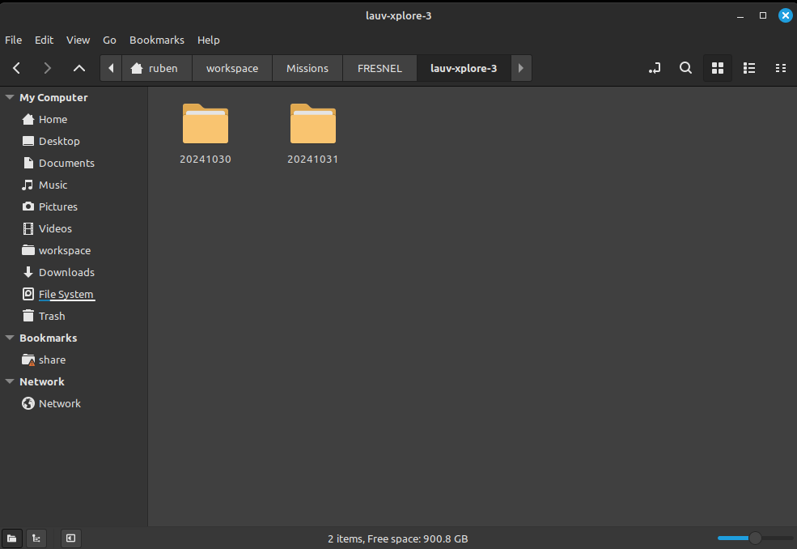
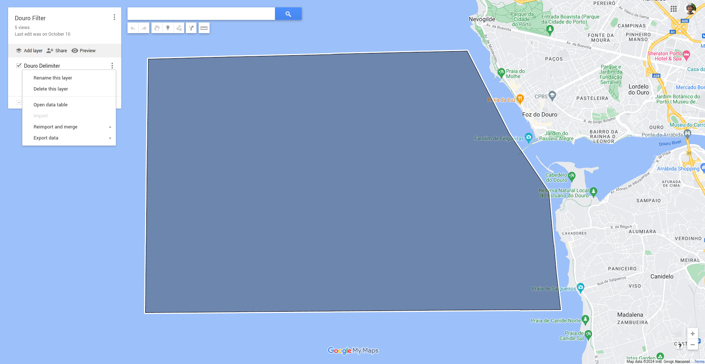

## PyIMCLSTS

This tool reads the IMC schema from a XML file, locally creates files containing the messages and connects (imports) the main global machinery.

See `/example` to check an example implementation of the Follow Reference maneuver.

Check the documentation page [here](https://choiwd.github.io/pyimclsts/).

### Quick start:
- Fancying a virtual env? (Not needed. Just in case you want to isolate it from your python setup)
```shell
$ sudo apt install python3.8-venv
$ python3 -m venv tutorial_env
$ source tutorial_env/bin/activate
```
- To use:
```shell
$ pip3 install pyimclsts
$ # or, if you are cloning the repo, from the folder where pyproject.toml is located:
$ pip3 install .
```
- Choose a folder and have a version of the IMC schema. Otherwise, it will fetch the latest IMC version from the LSTS git repository. Extract messages locally, with:
```shell
$ python3 -m pyimclsts.extract
```
This will locally extract the IMC.xml as python classes. You will see a folder called `pyimc_generated` which contains base messages, bitfields and enumerations from the IMC.xml file. They can be locally loaded using, for example:
```python
import pyimc_generated as pg
```
In the installed module, you will find some functions to allow you to connect to a vehicle and subscribe to messages, namely, a subscriber class.
```python
import pyimc_generated as pg
```

In the /example folder you can find scripts that use this library for various porpuses, such as reading and concatenating logs for the creation of the NetCDF files.  

## Log to NetCDf Exporter

If you followed the quick start guide correctly, you now have access to the pyimclsts library which essentially means that your python instalation is able to interpert IMC messages.

Lucky for you, somebody (me), also took the liberty to write a script (a very long one at that) that takes a number of LAUV log files and extracts and concatenates them into a single netCDF file.  
This amazing feat is contained in the very originally named `lsf2netcdf.py` file.

### A single csv to rule them all

Essentially, `lsf2netcdf.py` will go through all the logs files in a directory, specified by the user, and export specific data from the it, into csv files. You can find them next to the logs, inside the `mra` folder. These csv files are then concatenated into a single csv file, with some filtering (which you can costumize using arguments) and clean-up done.

### Metadata 

In the last stage of the script's runtime, this final csv file will then be parsed and used to generate the a netCDF file. 
If you're familiar with the format you will know that it usually contains various bits of metadata, some global, describing general info about the data contained in the file, and other, more specific, concerning the variables and coordinates, also, contained in the file. 
Before you call `lsf2netdf.py`, you can go into the `metadata` directory and edit the .json files you find. These .jsons are then used to fill the metadata contained in the netCDF. 

I shall now explain how to actually make use of this file and its arguments. 

### Execution

First, please make sure your working directory is the pyimclsts folder. Also make sure you call it as a python module (this means using the -m argument after calling python). You can see a full example of a command calling the script with all its optional arguements included. 

```shell
python3 -m example.lsf2netcdf -p path_to_your_file -t 6 -d polygon.csv --filter_underwater --force --clean  
```

### The arguments

`-p MISSION_PATH (Required)` 

Here you should specify the path to folders where your logs are located. Be carefull because the script WILL hunt down every Data.lsf.gz file inside your directory and use it.
Ideally, if you wanted to generate a netCDF file from the logs of a single day operation, the directory you provide should look like this:


It may happen that you want to concatenate files from 2 different days as a single netCDF file. This is also possible. Simply provide a directory where the logs from those 2 dates separated. The directory should look like this (folder names are irrelevant):



` -t MIN_TIME (Optional w/ preset)`

This argument filters out the logs by a minimum duration. It takes a value in minutes and filters out any log that has a duration shorter than the value you provided. The preset is 5. 

` -d DELIMITER_PATH (Optional)`

You can use this argument to filter out any vehicle locations that are outside a given polygon. To do this you can draw a polygon in [My Google Maps](https://www.google.com/mymaps), export as a csv and provide its path after the argument. 



` --filter_underwater (Optional)`

As the name suggests, this will filter out all data that is NOT underwater. 

` --force (Optional)`

If your log folders already contain .csv files, the script will simply use them instead of going through the log all over again. You can force it to generate new ones with this argument. 

` --clean (Optional)` 

After going through each log file, a csv file is saved to then concatenate once all log files have been processed. If you use this argument, those files will be deleted once the script has done its work. 

## Utils

Included in this repo are 2 util scripts. 
- `csv2netcdf.py` Takes the final concatenated csv file and generate a new netCDF file. If you want to edit something in the final csv file or make some changes to the metadata this is an easy way to do it. 
- `netcdf_editor.py` Essentially the same but it uses the netCDF file to generate another one. To be used if you changed the metadata. 

That's it. If any problems come up or you want suggest a new useful feauture (like additional filtering) you can do so by opening a new Issue or contacting somebody from the LSTS staff. 


