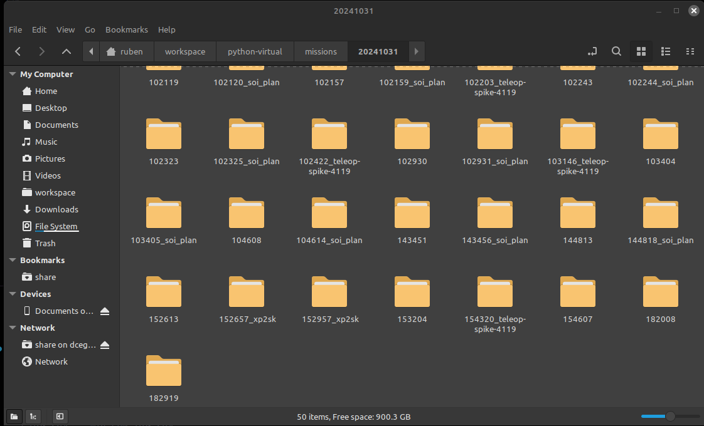

## PyIMCLSTS

This tool reads the IMC schema from a XML file, locally creates files containing the messages and connects (imports) the main global machinery.

See `/example` to check an example implementation of the Follow Reference maneuver.

Check the documentation page [here](https://choiwd.github.io/pyimclsts/).

### Quick start:
- Fancying a virtual env? (Not needed. Just in case you want to isolate it from your python setup)
```shell
$ sudo apt install python3.8-venv
$ python3 -m venv tutorial_env
$ source tutorial_env/bin/activate
```
- To use:
```shell
$ pip3 install pyimclsts
$ # or, if you are cloning the repo, from the folder where pyproject.toml is located:
$ pip3 install .
```
- Choose a folder and have a version of the IMC schema. Otherwise, it will fetch the latest IMC version from the LSTS git repository. Extract messages locally, with:
```shell
$ python3 -m pyimclsts.extract
```
This will locally extract the IMC.xml as python classes. You will see a folder called `pyimc_generated` which contains base messages, bitfields and enumerations from the IMC.xml file. They can be locally loaded using, for example:
```python
import pyimc_generated as pg
```
In the installed module, you will find some functions to allow you to connect to a vehicle and subscribe to messages, namely, a subscriber class.
```python
import pyimc_generated as pg
```

In the /example folder you can find scripts that use this library for various porpuses, such as reading and concatenating logs for the creation of the NetCDF files.  

### Log to NetCDf Exporter

If you followed the quick start guide correctly, you now have access to the pyimclsts library which essentially means that your python instalation is able to interpert IMC messages.

Lucky for you, somebody (me), also took the liberty to write a script (a very long one at that) that takes a number of LAUV log files and extracts and concatenates them into a single netCDF file.  
This amazing feat is contained in the very originally named lsf2netcdf.py file. I shall now explain how to make use of this file. 

First, please make sure you are in the pyimclsts folder. Also make sure you call it as a python module (this means using the -m argument when you call it). You can see a full example of a command calling the script with all its optional arguements included. 

```shell
~pyimclsts$ python3 -m example.lsf2netcdf -p path_to_your_file -t 6 -d polygon.csv --filter_underwater --force --clean  
```
Next, you can find a detailed explanation of the arguments you can use. 

### The arguments

`-p MISSION_PATH` 

Here you should specify the path to folders where your logs are located. You should be a bit carefull because the script WILL hunt down every Data.lsf.gz file inside your directory use it.
Ideally, if you wanted to generate a netCDF file from the logs of a single day operation, the directory you provide should look like this:



It may happen that you want to concatenate files from 2 different days as a single netCDF mission. This is also possible. Simply provide a directory the logs from those 2 dates separated. The directory should look like this:


` -t MIN_TIME `

This argument filters out the logs by a minimum. It takes a value in minutes and filters out any log that has a duration shorter than the value you provided, The preset is 5. 

` -d DELIMITER_PATH `

You can use this argument to filter out any vehicle locations that are outside a given polygon. To do this you can draw a polygon in [My Google Maps](https://www.google.com/mymaps), export as a csv and provide its path in the parameter. 


